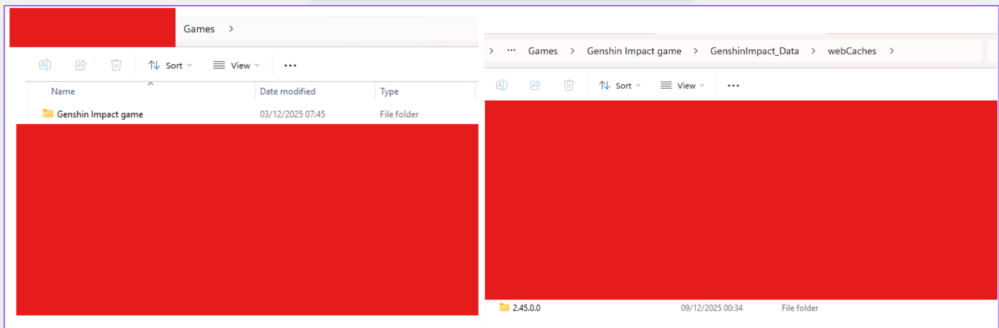

# 🌠 Genshin Impact Gacha Tool

This folder contains scripts to extract your wish history URL and calculate your pity counter.

## 📂 File List
| File Name | Description |
| :--- | :--- |
| **1_GetLink.bat** | 🔑 **STEP 1:** Finds the wish history link from game cache and copies it to Clipboard. |
| **2_Calc_Character.bat** | 🧮 **STEP 2 (Option A):** Calculates pity for **Character Event Banner** only. |
| **2_Calc_All.bat** | 📊 **STEP 2 (Option B):** Calculates pity for **ALL Banners** (Standard, Weapon, Character). |

---

## 🚀 How to use (Step-by-Step)

## 📂 How to find the `data_2` file
This tool reads the **cache file** directly from your computer. It's safer because no password or API key is needed.

### 1️⃣ Step 1: Open History in Game
Go to the Wish menu and click the **History** button. Wait for it to load completely.
*(This action generates a fresh key in your storage).*

---

### 2️⃣ Step 2: Find the Cache Folder
Go to your Genshin Installation folder:
`Genshin Impact Game` ➔ `GenshinImpact_Data` ➔ `webCaches`

Look for the folder with the **Latest Version Number** (or latest Date Modified).

---

### 3️⃣ Step 3: Get 'data_2' & Check Date ⚠️
Go deeper into: `.../Cache/Cache_Data/`
Find the file named **`data_2`**.

**🚨 CRITICAL CHECK:** Look at the **"Date Modified"**. It must match **RIGHT NOW**.
*(If the time is old, go back to Step 1 and open History again).*

---

### ✅ Final Step
Copy `data_2` to your desktop, then run **`1_GetLink.bat`**.

### Step 1: Get the Link 🔑

*Script will ask for the path to 'data_2' file.*

1. Open **Genshin Impact** on your PC.
2. Open the **Wish (Gacha)** page in-game.
3. Click on the **History** button (at the bottom of the wish screen) and wait for it to load.
4. Minimize the game.
5. Run `1_GetLink.bat`.
   - It will scan for the link.
   - Once found, it will say **"Link copied to clipboard"**.

### Step 2: Calculate Pity 🧮
*Make sure you have run Step 1 successfully.*

**Option A: Character Banner Only**

**Option B: All Banners (Timeline)**

1. Run `2_Calc_All.bat` (Recommended).
2. The script will automatically read the link from your clipboard.
3. It will start fetching data from Hoyoverse servers.
   - ⚠️ **Note:** The script runs in **Safe Mode** (slow speed) to prevent API errors. Please be patient.
4. Once finished, it will show your:
   - 5-Star History
   - Current Pity Count
   - Total Pulls

---

## 🛠️ Troubleshooting

**Q: Script says "Clipboard is empty" or "Invalid URL"**
A: You must run `1_GetLink.bat` first. Make sure you opened the History page in the game recently.

**Q: "Too many retries" error**
A: The Hoyoverse API is temporary blocking requests because of speed. Wait 15-30 minutes and try again.

**Q: Pity count seems wrong?**
A: The tool counts from your *last* 5-star item. Ensure the history loaded completely (Game history only keeps data for 6-12 months).