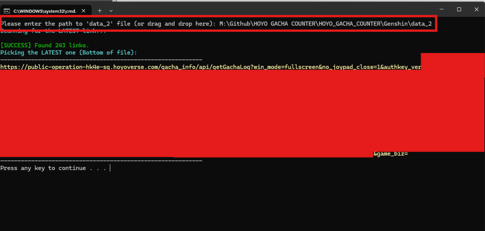

# 🌠 Genshin Impact Gacha Tool

This folder contains scripts to extract your wish history URL and calculate your pity counter.

## 📂 File List
| File Name | Description |
| :--- | :--- |
| **1_GetLink.bat** | 🔑 **STEP 1:** Finds the wish history link from game cache and copies it to Clipboard. |
| **2_Calc_Character.bat** | 🧮 **STEP 2 (Option A):** Calculates pity for **Character Event Banner** only. |
| **2_Calc_All.bat** | 📊 **STEP 2 (Option B):** Calculates pity for **ALL Banners** (Standard, Weapon, Character). |

---

## 🚀 How to use (Step-by-Step)

## 📂 How to find the `data_2` file
Since this tool runs in **Safe Mode** (local file reading), you need to manually provide the cache file.

### Step A: Generate the Key 🔑
1. Open **Genshin Impact** on your PC.
2. Go to the **Wish (Gacha)** menu.
3. Click on the **History** button (bottom of the screen).
4. **Wait until the list loads completely.** (This action writes the key to your hard drive).
5. You can now minimize or close the game.

### Step B: Locate the File 🔍
1. Navigate to your Genshin Impact installation folder.
   - Default is usually: `C:\Program Files\Genshin Impact\Genshin Impact Game\`
2. Go deep into these folders:
   `GenshinImpact_Data` ➔ `webCaches` ➔ `(Version Number)` ➔ `Cache` ➔ `Cache_Data`
   
   > 💡 **Note:** The `(Version Number)` folder changes with game updates (e.g., `2.28.0.0`). Always pick the folder with the **highest number** or **latest date**.

3. Inside `Cache_Data`, look for a file named **`data_2`**.

### Step C: ⚠️ CRITICAL CHECK (Date Modified) ⚠️
Before copying, look at the **"Date Modified"** column in Windows Explorer.
*   ✅ **CORRECT:** The time matches **RIGHT NOW** (when you opened the History page).
*   ❌ **WRONG:** The time is from yesterday or hours ago. (If so, go back to Step A and open History again).

### Step D: Copy & Run
1. Copy `data_2` to your Desktop or a folder easy to find.
2. Run `1_GetLink.bat` and drag the file into the window.

### Step 1: Get the Link 🔑

*Script will ask for the path to 'data_2' file.*

1. Open **Genshin Impact** on your PC.
2. Open the **Wish (Gacha)** page in-game.
3. Click on the **History** button (at the bottom of the wish screen) and wait for it to load.
4. Minimize the game.
5. Run `1_GetLink.bat`.
   - It will scan for the link.
   - Once found, it will say **"Link copied to clipboard"**.

### Step 2: Calculate Pity 🧮
*Make sure you have run Step 1 successfully.*

**Option A: Character Banner Only**

**Option B: All Banners (Timeline)**

1. Run `2_Calc_All.bat` (Recommended).
2. The script will automatically read the link from your clipboard.
3. It will start fetching data from Hoyoverse servers.
   - ⚠️ **Note:** The script runs in **Safe Mode** (slow speed) to prevent API errors. Please be patient.
4. Once finished, it will show your:
   - 5-Star History
   - Current Pity Count
   - Total Pulls

---

## 🛠️ Troubleshooting

**Q: Script says "Clipboard is empty" or "Invalid URL"**
A: You must run `1_GetLink.bat` first. Make sure you opened the History page in the game recently.

**Q: "Too many retries" error**
A: The Hoyoverse API is temporary blocking requests because of speed. Wait 15-30 minutes and try again.

**Q: Pity count seems wrong?**
A: The tool counts from your *last* 5-star item. Ensure the history loaded completely (Game history only keeps data for 6-12 months).