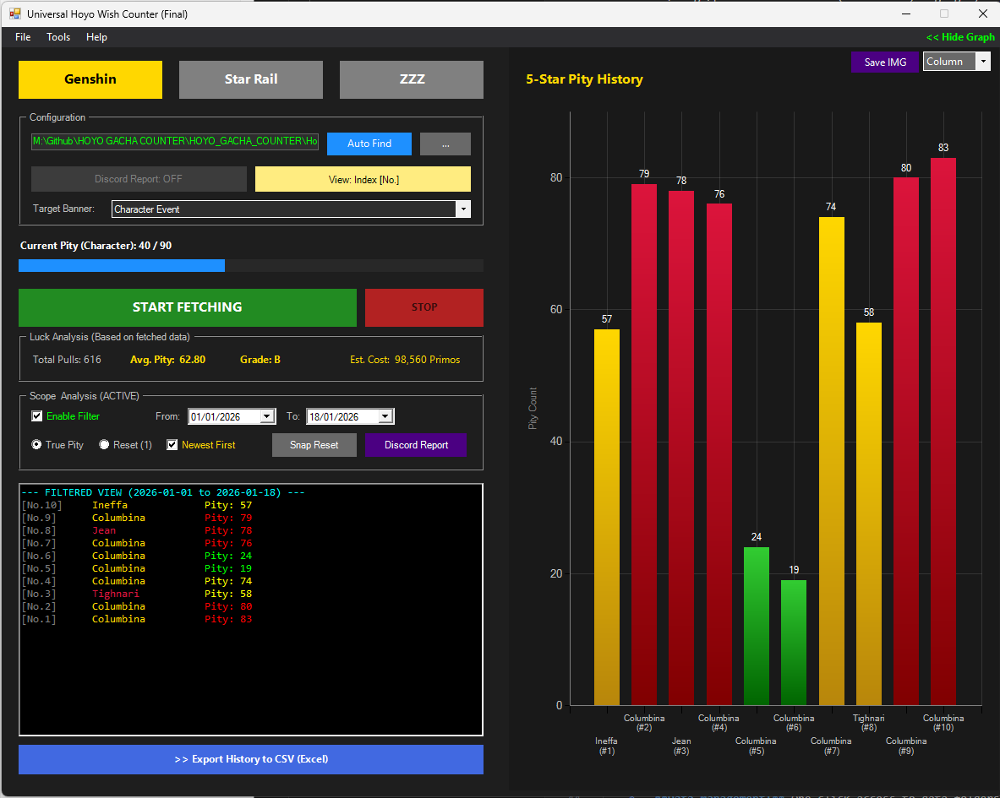
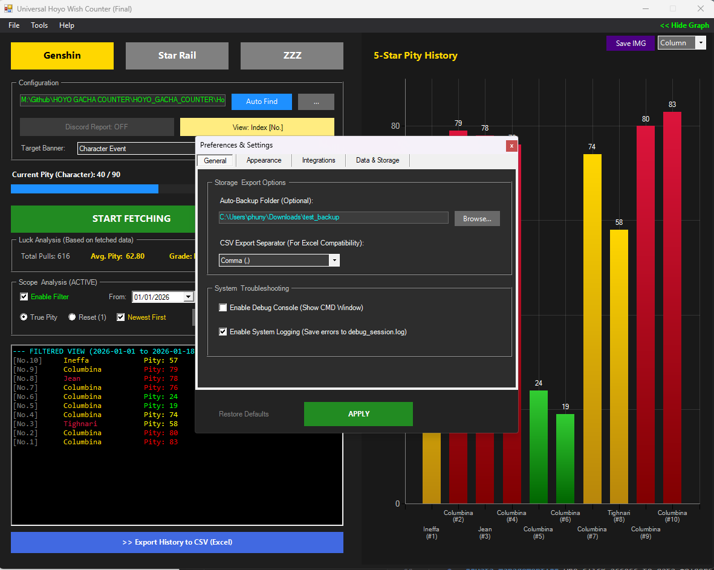
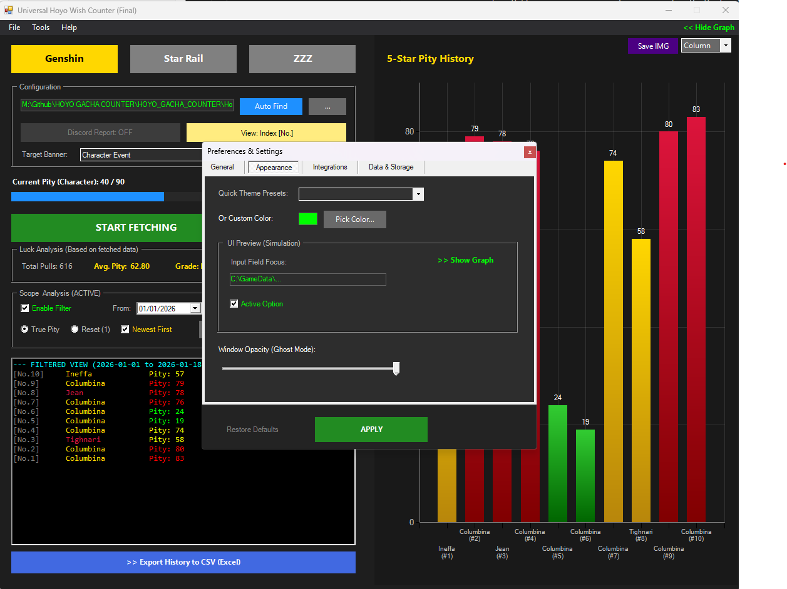
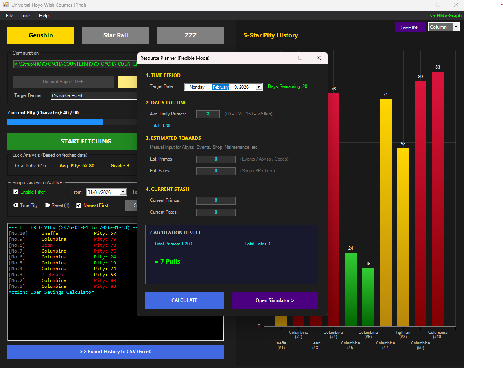
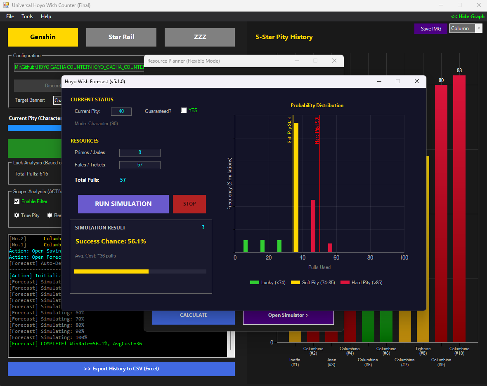

# Universal Hoyo Wish Counter (Ultimate Edition)

 -lightgrey.svg) 

**Universal Hoyo Wish Counter** is a robust, local-based application designed to fetch, analyze, and visualize Gacha history for **Genshin Impact**, **Honkai: Star Rail**, and **Zenless Zone Zero**.

Built entirely with **PowerShell** and **.NET WinForms**, this tool runs locally on your machine, ensuring data privacy while offering advanced features like pity tracking, luck grading, resource planning, and simulation.

---

### 🖼️ Preview

---

### ✨ Key Features (v6.0.0)

#### 🎮 Core Capabilities
*   **Multi-Game Support:** Seamlessly switch between Genshin Impact, Star Rail, and ZZZ.
*   **Auto-Detect System:** Automatically locates game logs and cache files (`data_2`) for instant fetching.
*   **Privacy First:** Runs 100% locally using the official game cache API. No login credentials required.

#### 📊 Analytics & Visualization
*   **Interactive Charts:** Visualize history via Column, Bar, Line, or Doughnut charts.
*   **Pity Tracker:** Dynamic visual gauge showing current pity status (Standard 90 / Weapon 80).
*   **Luck Analysis:**
    *   **Luck Grade:** Automated grading system (**SS** to **F**) based on average pity.
    *   **Win/Loss:** Tracks 50/50 wins and off-banner losses.
    *   **Cost Estimation:** Calculates total currency used.
*   **Time Machine:** Advanced date filtering to analyze specific periods (e.g., "This Month" or "Last Year").

#### 🛠️ Professional Tools
*   **Savings Planner:** Calculate future resources based on daily income, events, and target dates.
*   **Wish Simulator:** Monte Carlo simulation (100k runs) to predict success rates based on your actual budget.
*   **Table Viewer:** Spreadsheet-style view for searching and sorting specific pulls.
*   **Data Export:** Export data to **CSV** (Excel compatible) or Raw **JSON**.

#### ⚙️ Ultimate Customization (New in v6.0)
*   **Preferences Window (F2):**
    *   **Appearance:** Custom themes (Cyber Cyan, Gold, Purple, etc.) and Real-time **Ghost Mode** (Window Opacity).
    *   **Data Management:** One-click access to data folders, force backups, and cache cleaning.
    *   **System:** Debug Console toggle and detailed File Logging (`debug_session.log`).
*   **Discord Integration:** Send rich, color-coded wish reports to your Discord Webhook.

---

### 🚀 Installation & Usage

1.  **Download** the source code files (keep all `.ps1` files in the same folder).
2.  **Right-Click** on `App.ps1`.
3.  Select **"Run with PowerShell"** or dubble click `Start_GUI.bat`.

> **Note:** If the script closes immediately, try running PowerShell as Administrator and execute:
> `Set-ExecutionPolicy RemoteSigned`

---

### 📸 Gallery

| Settings (General) | Settings (Appearance) |
| :---: | :---: |
|  |  |

| Resource Planner | Wish Simulator |
| :---: | :---: |
|  |  |

---

### 👨‍💻 Credits
*   **Created by:** [ PHUNYAWEE ]
*   **Engine:** PowerShell 5.1 & .NET Windows Forms