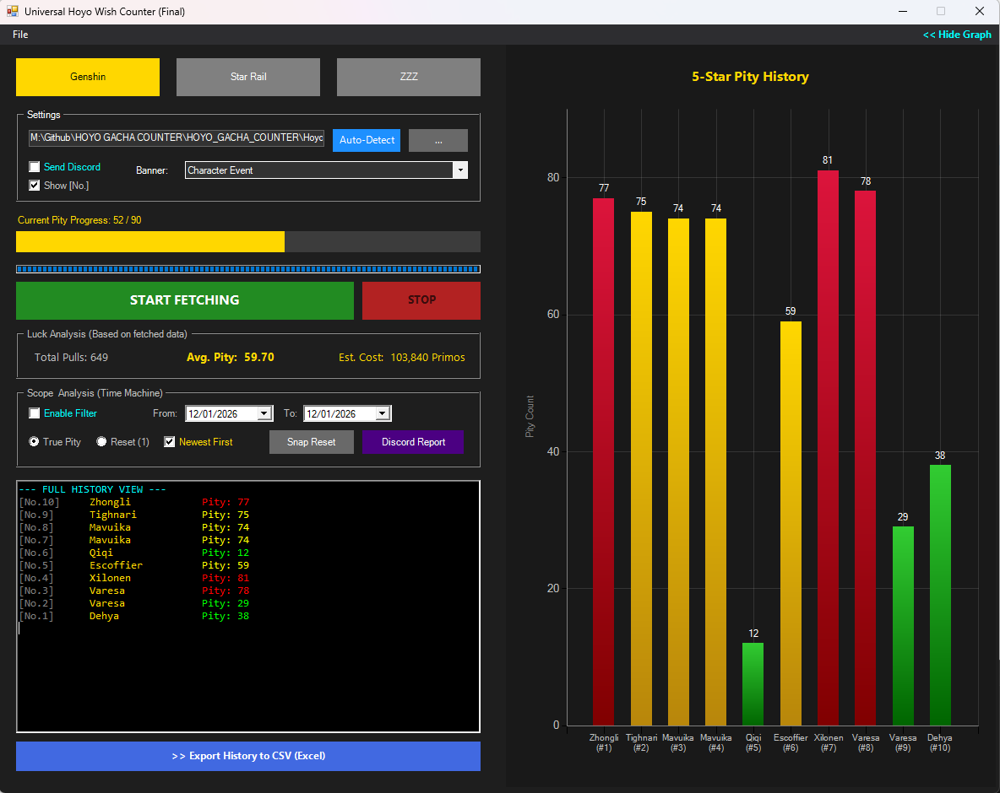
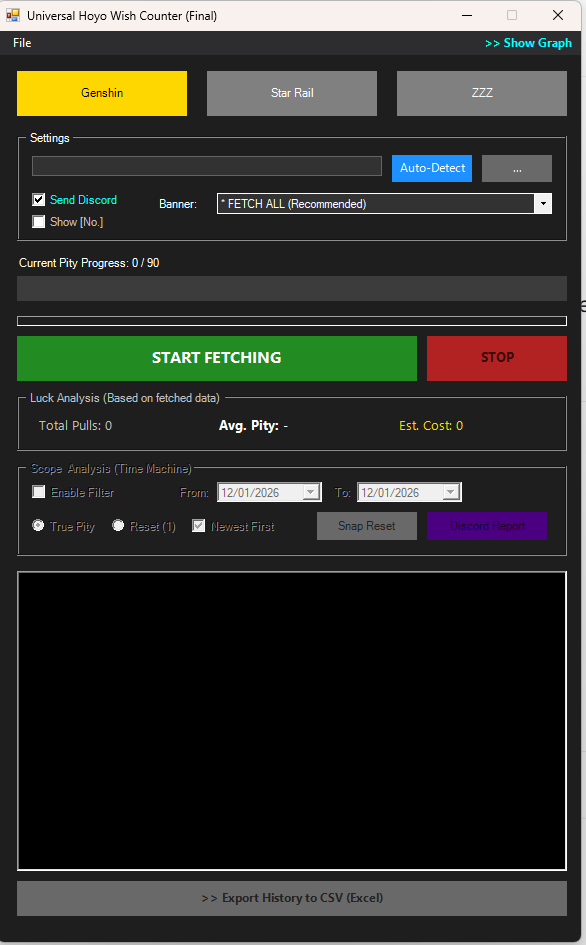
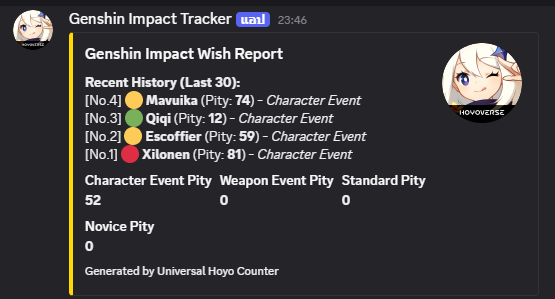
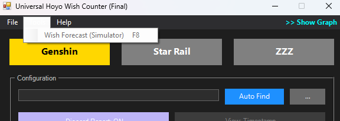
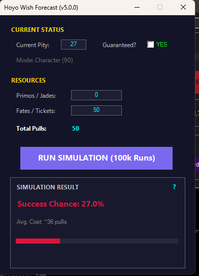
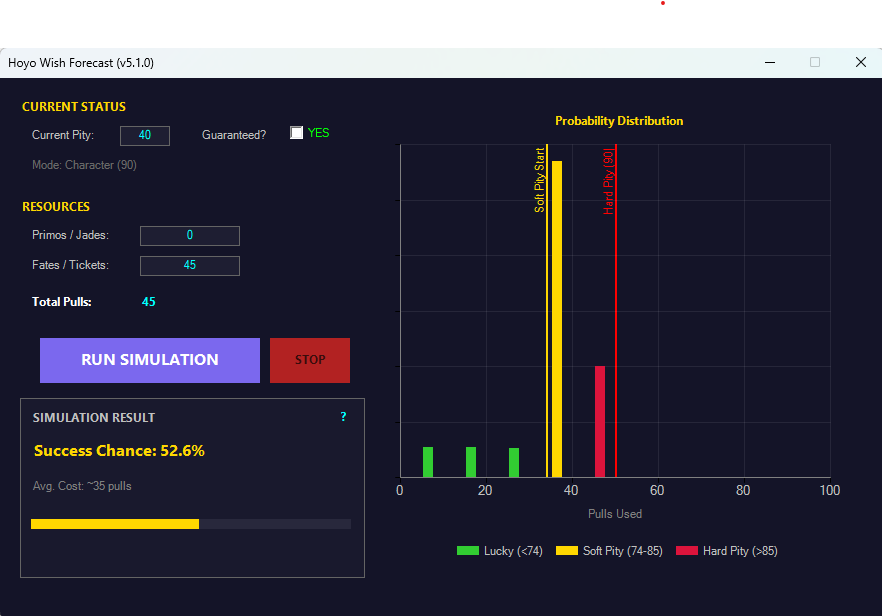

<div align="center">

# 🌠 Universal Hoyo Wish Counter (GUI V4)

[](./README_TH.md)
[](./README.md)
[](./App.ps1)

**โปรแกรมนับ Pity และเช็คประวัติกาชาสำหรับ Genshin Impact, Honkai: Star Rail และ Zenless Zone Zero**
เวอร์ชันใหม่ v4.0 มาพร้อมระบบกราฟ, Time Machine (เลือกช่วงเวลา) และระบบค้นหาไฟล์อัตโนมัติ


*(ใหม่ใน v4.0: กราฟวิเคราะห์ความเกลือแบบโต้ตอบได้ & ระบบกรองวันที่)*

</div>

---

## ✨ มีอะไรใหม่ใน v4.0?
*   **🧠 SRS Auto-Detect:** ระบบค้นหาไฟล์อัตโนมัติแบบใหม่ (ใช้ Logic เดียวกับเว็บ SRS) หาเจอแน่นอนแม้ลงเกมไว้ไดรฟ์อื่น
*   **⏳ Time Machine:** เจาะเวลาหาอดีต! เลือกกรองดูประวัติเฉพาะช่วงเวลาที่ต้องการได้ (เช่น ดูเฉพาะเดือนนี้ หรือตู้ที่แล้ว)
*   **📊 Interactive Graph:** กราฟแท่งแสดงประวัติ 5 ดาว พร้อมแบ่งสีตามความเกลือ (เขียว/ทอง/แดง)
*   **⚡ Smart Snap:** ปุ่มวิเศษ! ช่วยดีดวันที่เริ่มต้นให้ไปชนกับจุดรีเซ็ต Pity (หลังได้ 5 ดาว) โดยอัตโนมัติ ทำให้คำนวณเรตได้แม่นยำ
*   **📱 Manual Discord Report:** ปุ่มส่งรายงานเข้า Discord ที่เลือกช่วงเวลาเองได้ (เช่น ส่งอวดเพื่อนเฉพาะตู้นี้)

---

## 📂 รายชื่อไฟล์
| ชื่อไฟล์ | คำอธิบาย |
| :--- | :--- |
| **Start_GUI.bat** | ▶️ **ตัวเปิดโปรแกรม:** ดับเบิลคลิกที่นี่เพื่อเริ่มใช้งาน (แนะนำ) |
| **App.ps1** | 🖼️ **หน้าจอโปรแกรม:** ไฟล์หลักของส่วนติดต่อผู้ใช้ |
| **HoyoEngine.ps1** | ⚙️ **สมองของระบบ:** คำนวณเลข Pity และดึงข้อมูล (ห้ามลบ/ห้ามรันตรงๆ) |
| **config.json** | 📝 **ตั้งค่า:** สำหรับใส่ Discord Webhook (ถ้ามี) |

---

## 🚀 วิธีใช้งาน

### 📌 PHASE 1: สร้างลิงก์ดึงข้อมูล
โปรแกรมนี้อ่านข้อมูลจาก Cache ของเกมโดยตรง ปลอดภัย 100% แต่ต้องสร้างลิงก์ก่อน

1.  **เข้าเกม** (Genshin, HSR หรือ ZZZ)
2.  เปิดหน้า **ประวัติการอธิษฐาน (History)** ในเกม
3.  รอให้รายการโหลดเสร็จ แล้ว **ปิดเมนู** ได้เลย
    *   *ขั้นตอนนี้จะทำให้เกมสร้างไฟล์ `data_2` ที่มีลิงก์ล่าสุดขึ้นมา*

---

### ⚡ PHASE 2: เริ่มใช้งาน

#### 1️⃣ เปิดโปรแกรม & ค้นหาไฟล์
ดับเบิลคลิก **`Start_GUI.bat`**
1.  เลือกเกมที่ต้องการ (ปุ่มด้านบน)
2.  กดปุ่มสีฟ้า **"Auto-Detect"**
    *   *ระบบ v4.0 จะสแกนหาที่อยู่เกมของคุณเอง ไม่ต้องหาไฟล์เองให้ปวดหัว*



#### 2️⃣ ดึงข้อมูล (Fetch)
กดปุ่มสีเขียว **"START FETCHING"** โปรแกรมจะเริ่มดึงข้อมูลทีละหน้า
*   เมื่อเสร็จแล้ว แผงควบคุม **Filter** และปุ่ม **Graph** จะปลดล็อกให้ใช้งาน

#### 3️⃣ ใช้ Time Machine (Filter)
อยากดูเฉพาะตู้นี้ หรือเดือนนี้?
1.  ติ๊กถูกที่ **"Enable Filter"**
2.  เลือกวันที่ **From** (เริ่ม) และ **To** (สิ้นสุด)
3.  กดปุ่ม **"[SNAP] Find Reset"** เพื่อให้โปรแกรมช่วยหาจุด Pity 0 ที่ใกล้ที่สุดให้อัตโนมัติ
4.  **True Pity Mode:** แม้จะเลือกดูแค่บางช่วง แต่โปรแกรมจะคำนวณ Pity ต่อเนื่องจากอดีตให้ถูกต้องเสมอ


#### 4️⃣ ดูกราฟ (Visual Analytics)
กดเมนู **`>> Show Graph`** ที่มุมขวาบน
*   หน้าต่างจะขยายออกพร้อมกราฟแท่งสวยงาม
*   **ความหมายสี:** <span style="color:green">เขียว (ออกไว)</span>, <span style="color:gold">ทอง (Soft Pity)</span>, <span style="color:red">แดง (Hard Pity / เกลือ)</span>

---

## 💬 เชื่อมต่อ Discord
ส่งรายงานเข้าห้อง Discord ของคุณเองได้ง่ายๆ

1.  สร้างไฟล์ `config.json` ในโฟลเดอร์โปรแกรม (ถ้ายังไม่มี):
    ```json
    {
        "webhook_url": "https://discord.com/api/webhooks/ใส่_URL_ของคุณที่นี่"
    }
    ```
2.  **Auto Send:** ส่งสรุปทั้งหมดทันทีที่ดึงข้อมูลเสร็จ
3.  **Manual Send:** กดปุ่ม **"Discord Report"** ในช่อง Filter เพื่อส่งรายงานเฉพาะช่วงเวลาที่เลือก (เรียงลำดับ ใหม่->เก่า หรือ เก่า->ใหม่ ได้ตามใจชอบ)



---

## 🔮 v5.0.0 - อัปเดตระบบพยากรณ์กาชา (Wish Forecast)
> *"เลิกมโน แล้วมาดูตัวเลขจริง... เพราะคณิตศาสตร์ไม่เคยโกหกคุณ"*

ขอแนะนำฟีเจอร์ใหม่ล่าสุด **"ระบบจำลองการเปิดกาชา (Simulator)"** ที่ไม่ใช่แค่เครื่องคิดเลขธรรมดา แต่ใช้ระบบ **Monte Carlo Simulation** จำลองเหตุการณ์จริงกว่า **100,000 รอบ** เพื่อคำนวณโอกาสที่คุณจะได้ตัวละครที่รัก!



## 🔮 v5.1.0 - Wish Forecast & Visual Analytics
> *"เลิกมโน แล้วมาดูตัวเลขจริง... เพราะคณิตศาสตร์ไม่เคยโกหกคุณ"*

ขอแนะนำฟีเจอร์ใหม่ล่าสุด **"ระบบจำลองและวิเคราะห์กาชา (Simulator)"** ที่มาพร้อมกับ **กราฟความน่าจะเป็น (Probability Graph)** สวยงาม ดูง่าย ไม่ต้องนั่งเดาตัวเลขเองอีกต่อไป ขับเคลื่อนด้วยระบบ Monte Carlo ที่จำลองการกดจริงกว่า **100,000 รอบ**



### ✨ ฟีเจอร์เด่น
*   **🧠 ระบบดึงค่าอัจฉริยะ (Auto-Detect):** โปรแกรมจะอ่านค่า **Pity ปัจจุบัน**, **สถานะการันตี**, และ **ชนิดตู้ (ตัวละคร/อาวุธ)** มาตั้งค่าให้ทันที
*   **📊 กราฟวิเคราะห์ความเกลือ (New!):** แสดงกราฟแท่ง (Histogram) ให้เห็นชัดๆ ว่าโอกาสได้ตัวละครกองกันอยู่ที่โรลไหน
    *   **🟩 โซนดวงดี:** ช่วงก่อนถึง Soft Pity
    *   **🟨 โซน Soft Pity:** ช่วงที่คนส่วนใหญ่ได้ของ (74-85 โรล) มีไฮไลท์สีทองชัดเจน
    *   **🟥 โซนเกลือ:** ช่วง Hard Pity สำหรับคนดวงกุด
    *   **Markers:** มีเส้นขีดบอกชัดเจนว่า Soft Pity ของคุณจะเริ่มทำงานที่โรลที่เท่าไหร่
*   **🎲 แม่นยำด้วยการจำลองจริง:** จำลองเหตุการณ์จริง 1 แสนครั้ง เพื่อความแม่นยำทางสถิติสูงสุด
*   **🛑 ควบคุมได้ดั่งใจ:** สามารถกดปุ่ม **STOP** เพื่อยกเลิกการคำนวณกลางคันได้ทันที

### 🚀 วิธีใช้งาน
1.  กด Fetch ข้อมูลในหน้าแรกตามปกติ
2.  ไปที่เมนู **Tools > 🔮 Wish Forecast (Simulator)** หรือกดปุ่ม **F8**
3.  ใส่จำนวน **เพชร (Primogems)** หรือ **ตั๋ว (Fates)** ที่มี
4.  กดปุ่ม **RUN SIMULATION** แล้วรอดูกราฟวิเคราะห์ผลได้เลย!




---

## 🛠️ ปัญหาที่พบบ่อย

**Q: Auto-Detect หาไฟล์ไม่เจอ?**
A: ตรวจสอบว่าคุณเพิ่งเปิดหน้าประวัติในเกมมาสดๆ ร้อนๆ หรือไม่? ถ้ายังไม่ได้ ให้ใช้ปุ่ม **"Browse..."** เพื่อหาไฟล์ `data_2` ในโฟลเดอร์ `webCaches` ของเกมด้วยตัวเอง

**Q: ปุ่ม Graph หรือ Discord กดไม่ได้ (สีเทา)**
A: คุณต้องกด **"START FETCHING"** ให้สำเร็จอย่างน้อย 1 ครั้งก่อน ฟีเจอร์พวกนี้ถึงจะทำงาน

**Q: ขึ้น Error "AuthKey timeout" หรือ "Link Expired"**
A: ลิงก์ของเกมมีอายุแค่ 1 ชั่วโมงครับ ให้เข้าเกมไปเปิดหน้าประวัติใหม่อีกครั้งเพื่อรีเฟรชลิงก์

---

## 📜 เครดิต
*   **พัฒนาโดย:** ใช้ PowerShell และ .NET Windows Forms
*   **แนวคิด Logic:** อ้างอิงวิธีแกะลิงก์จาก Paimon.moe และวิธีหาไฟล์ Log จาก Star Rail Station (SRS)