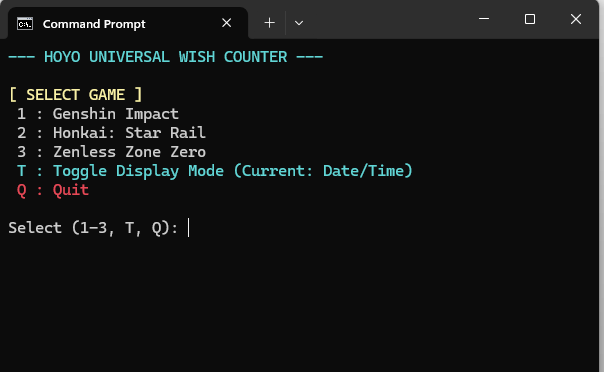
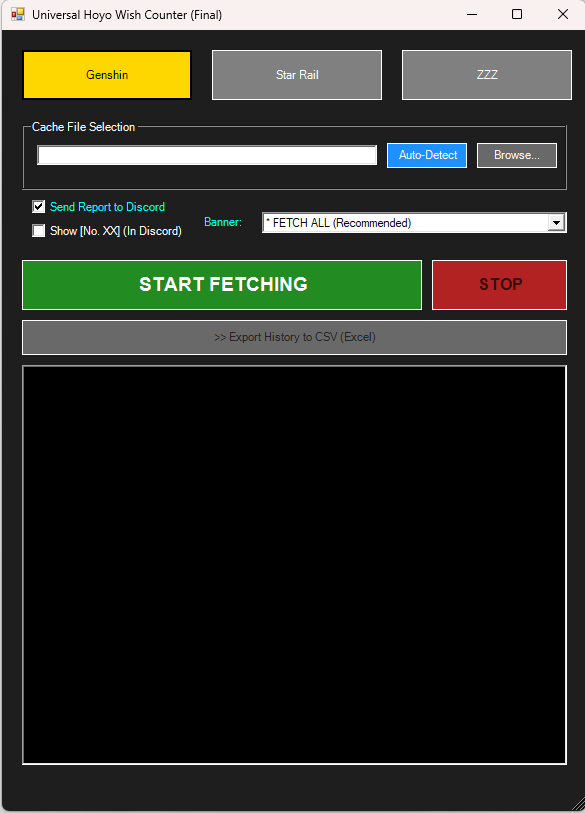
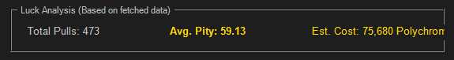
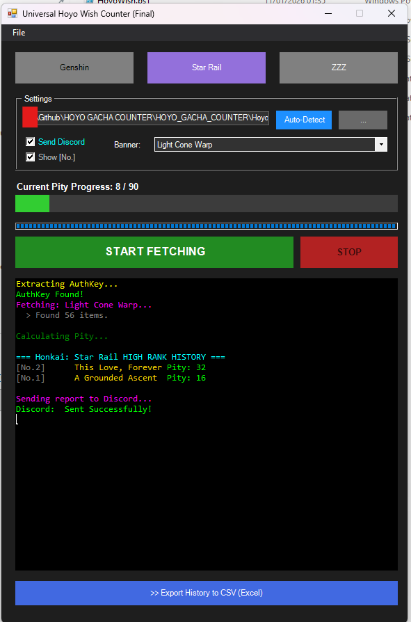
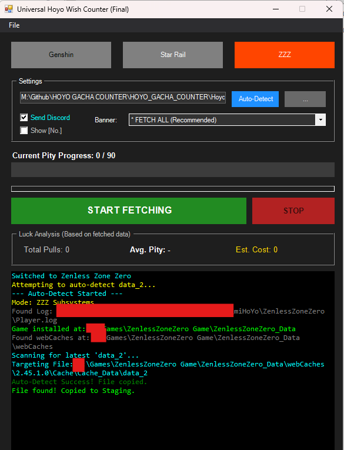

# 🎨 Visual Update Log: Version 3.1.0

> **"From Simple Console to Modern Dashboard"**
> This update brings a massive overhaul to the user interface, introducing Luck Analysis, Pity Meters, and a robust Auto-Detect system.

---

## 🆚 The Evolution (เปรียบเทียบความเปลี่ยนแปลง)

### The Dashboard
From a command-line script to a full-featured Windows application.

| Previous Versions (Legacy) | ✨ New Version 3.1.0 |
| :---: | :---: |
| **1. The Console Era**   **2. Early GUI (Beta)**  | **3. Final Dashboard**   |
| *Command Line > Simple Form* | *Full Dashboard with Menu Bar, Stats, and Pity Meter.* |

---

## 🌟 Feature Spotlight (ฟีเจอร์เด่น)

### 📊 1. Luck Analysis Dashboard (วิเคราะห์ดวง)
Are you lucky or salty? The tool now calculates your account's performance instantly.

*   **Total Pulls:** How many wishes fetched in this session.
*   **Avg. Pity:** Color-coded average! (e.g., **Green** = Lucky, **Red** = Salty).
*   **Est. Cost:** Calculates how many Primogems/Jades/Polychromes you spent.

### 🌡️ 2. Dynamic Pity Meter
Visualizes your progress towards the Hard Pity (90).

*   **Color Coded:** Changes from **Green** -> **Gold** -> **Red** as you approach 90.
*   **Current Pity:** Shows the exact count since your last 5-star.

### 🔍 3. Transparent Auto-Detect
No more guessing. The log window tells you exactly what the tool is doing.

*   **Smart Parsing:** Identifies the game path via `Player.log` or `output_log.txt`.
*   **Drive Detection:** Confirms discovery on custom drives (e.g., `M:\Games\...`).

---

## 🚀 Why upgrade to 3.1.0?
- **Smarter:** Handles Genshin, HSR, and ZZZ with specific logic for each.
- **Deeper:** Gives you stats (Avg Pity, Cost) not found in the in-game history.
- **Cleaner:** Fixed all console spam and path errors.

[🔙 Back to Main README](./README.md)