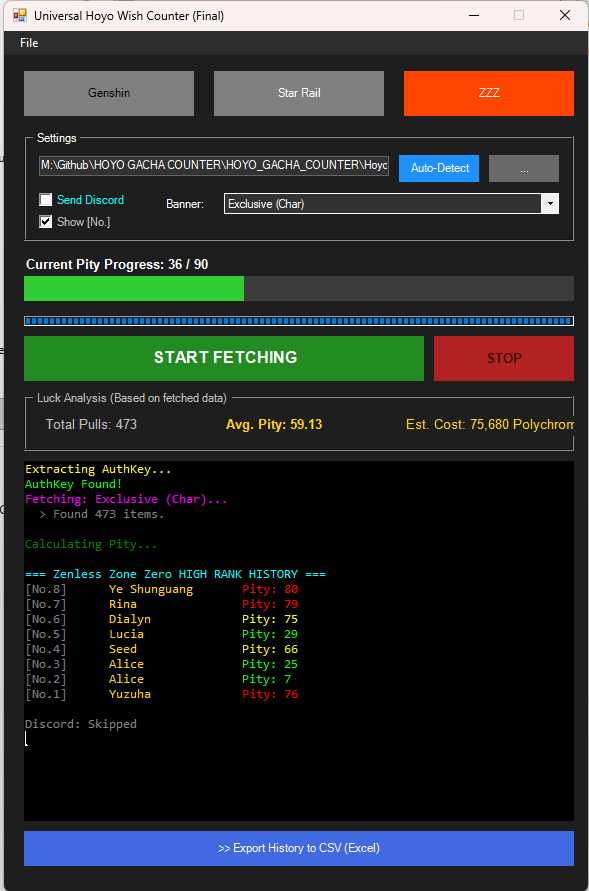

# 🎨 Visual Update Log: Version 4.0.0

> **"Beyond Tracking: The Analytics Era"**
> Version 4.0 isn't just an update; it's a complete evolution. We've introduced Time Travel (Filtering), Visual Analytics (Graphing), and Industry-Standard Detection Logic (SRS).

---

## 🆚 The Evolution (Before vs After)

### The Dashboard Interface
From a static tracker to a dynamic analytics suite.

| Version 3.1.0 (Legacy) | ✨ **Version 4.0.0 (The Update)** |
| :---: | :---: |
|  |  |
| *Standard Pity Tracking* | *Expanded UI with Menu Bar, Graph Toggle, and SRS Logic.* |

---

## 🌟 Feature Spotlight (New in v4.0)

### ⏳ 1. Time Machine & Smart Filter
Stop guessing your monthly stats. Now you can slice your history by date.

*   **Custom Range:** Select specific dates to analyze specific banners.
*   **True Pity Engine:** Even when filtering, the tool calculates "True Pity" by checking your *entire* history in the background.
*   **[SNAP] Reset:** One-click button to align your start date to the nearest Pity 0 (perfect for "Current Banner" stats).

### 📈 2. Interactive Analytics Graph
Numbers are good, but visuals are better.

*   **Expandable Panel:** Click `>> Show Graph` to reveal a hidden analytics dashboard.
*   **Color-Coded Luck:** Bars change color based on pull luck:
    *   **Green**: Early (Lucky!)
    *   **Gold**: Soft Pity range.
    *   **Red**: Hard Pity (Salty...).
*   **Tooltip Support:** Hover over any bar to see exact details.

### 🧠 3. SRS Logic Auto-Detect
We rewrote the detection engine from scratch.

*   **Old Method:** Checked hardcoded paths (C:\...).
*   **New SRS Method:** Scans `Player.log` and `output_log.txt` to find the *actual* installation path, supporting **Custom Drives (D:, E:, etc.)** and different game versions instantly.

### 📱 4. Targeted Discord Reporting
Share exactly what you want, not just the whole history.

*   **Manual Report Button:** Located in the Filter panel.
*   **Context Aware:** Sends a report based on your *current filter*.
*   **Sorting Control:** Choose between **Newest First** or **Oldest First**.

---

## 🚀 Why upgrade to 4.0.0?
- **Analysis:** You can now answer questions like *"How was my luck in 2024?"* or *"Did I win 50/50 on the last banner?"* visually.
- **Reliability:** The new SRS engine finds your files when others fail.
- **Control:** You decide what data to see and what data to share.

[🔙 Back to Main README](./README.md)