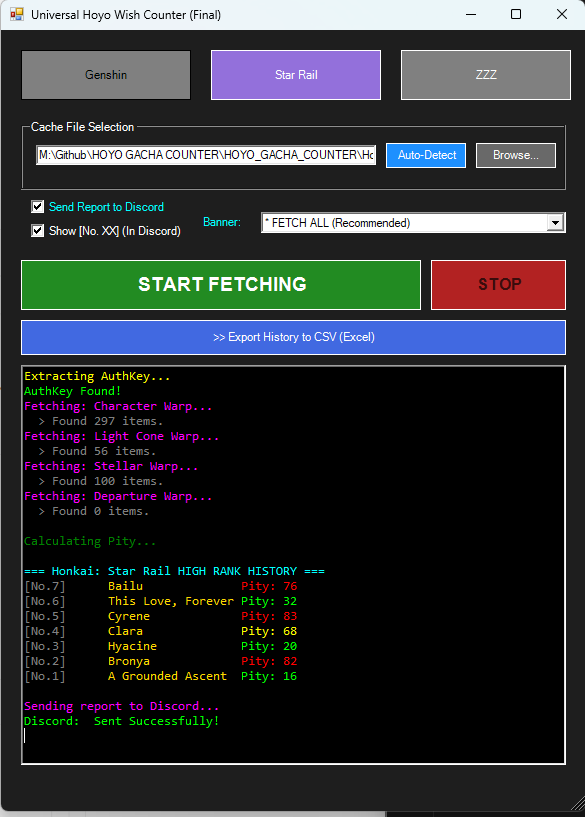
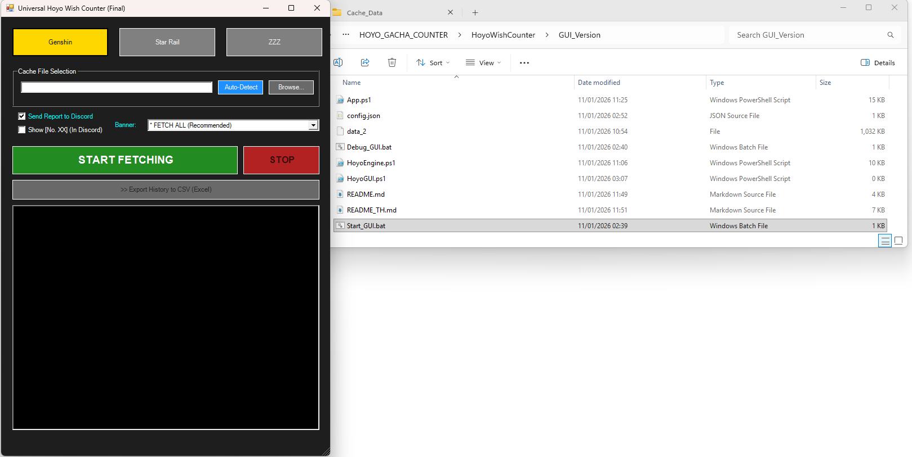
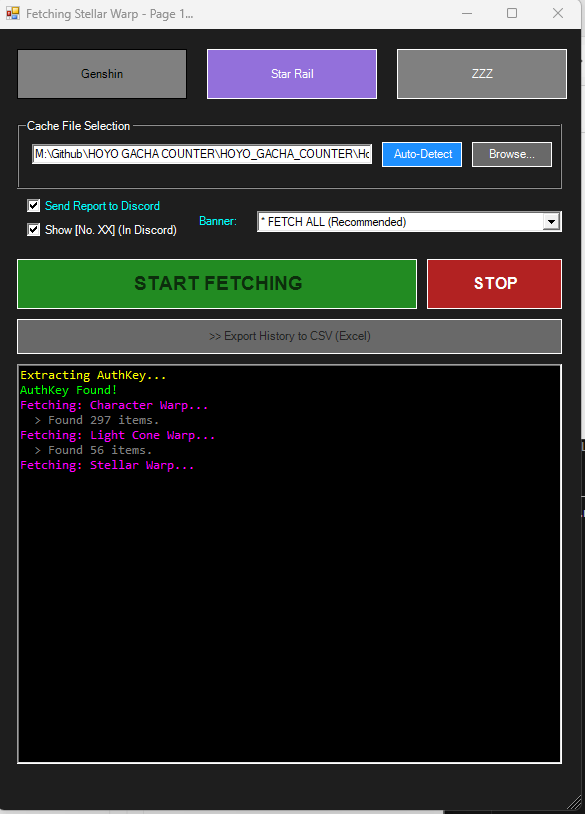
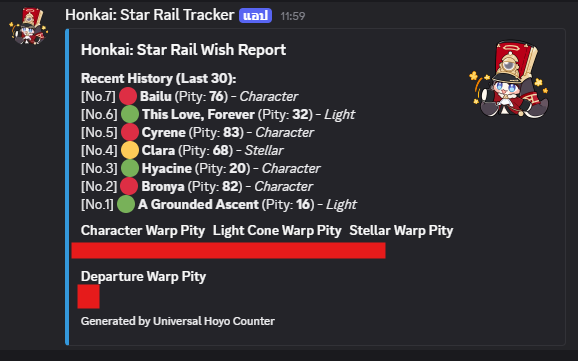

<div align="center">

# 🌠 Universal Hoyo Wish Counter (GUI Version)

[](./README_TH_01.md)
[](./README_01.md)

**The Ultimate Gacha Tracker for Genshin Impact, Honkai: Star Rail, and Zenless Zone Zero.**
Now with a graphical interface, CSV Export, and Auto-Detect capabilities.


*(User-friendly interface with instant calculation)*

</div>

---

## 📂 File List
| File Name | Description |
| :--- | :--- |
| **Start_GUI.bat** | ▶️ **Launcher:** Double-click this to start the program. |
| **App.ps1** | 🖼️ **GUI Script:** The main interface window. |
| **HoyoEngine.ps1** | ⚙️ **Core Logic:** Handles API fetching and calculations (Do not run directly). |
| **config.json** | 📝 **Settings:** Stores your Discord Webhook URL (Optional). |

---

## 🚀 Usage Guide

### 📌 PHASE 1: Generate the Key
This tool reads the official game cache safely. You need to refresh the link first.

1.  **Open the Game** (Genshin, HSR, or ZZZ).
2.  Open the **History (Wish/Warp/Signal)** menu in-game.
3.  Wait for the list to load, then **close the menu**.
    *   *This action generates a fresh `data_2` file with a valid link.*

---

### ⚡ PHASE 2: Run the Tool

#### 1️⃣ Launch the App
Double-click **`Start_GUI.bat`**. The program window will appear.

#### 2️⃣ Select Game & File
1.  Click the button for your game (e.g., **Genshin**).
2.  Click **"Auto-Detect"** (Blue button).
    *   The tool will automatically search for the `data_2` file in your system.
    *   *If Auto-Detect fails:* Click "Browse..." and find the file manually in your game's `webCaches` folder.



#### 3️⃣ Fetch Data
1.  (Optional) Select a specific Banner or leave it as **"* FETCH ALL"**.
2.  Click **"START FETCHING"** (Green button).
3.  The tool will read your history page by page.

#### 4️⃣ View Results & Export
*   **Log Window:** Shows your 5-Star history and Pity count.
*   **Discord:** Sends a stylish report to your server (if configured).
*   **Export:** Click **">> Export History to CSV"** to save your data to an Excel-readable file.



---

## 💬 Discord Setup (Optional)
To enable Discord notifications:

1.  Create a file named `config.json` in the same folder.
2.  Paste your Webhook URL inside like this:

```
json
{
    "webhook_url": "https://discord.com/api/webhooks/YOUR_WEBHOOK_URL_HERE"
}
```


*(The bot will send a summary like this directly to your server)*

## 🛠️ Troubleshooting
**Q: "Error: HoyoEngine.ps1 not found!"**
A: Make sure **App.ps1** and **HoyoEngine.ps1** are in the same folder. Always run the tool via Start_GUI.bat.

**Q: "AuthKey not found" or "Link Expired"**
A: The link in the cache file has expired (it lasts about 1 hour).
Fix: Open the History menu in the game again, then click **"Auto-Detect"** and **"Start Fetching"** again.

**Q: Auto-Detect cannot find the file.**
A: If you installed the game in a custom drive (not C:), use the **"Browse..."** button to locate the data_2 file manually inside the webCaches folder of your game.


## 📜 Credits
**Core Logic & GUI:** Developed using PowerShell and Windows Forms.
**AuthKey Extraction:** Logic inspired by community methods (paimon.moe).