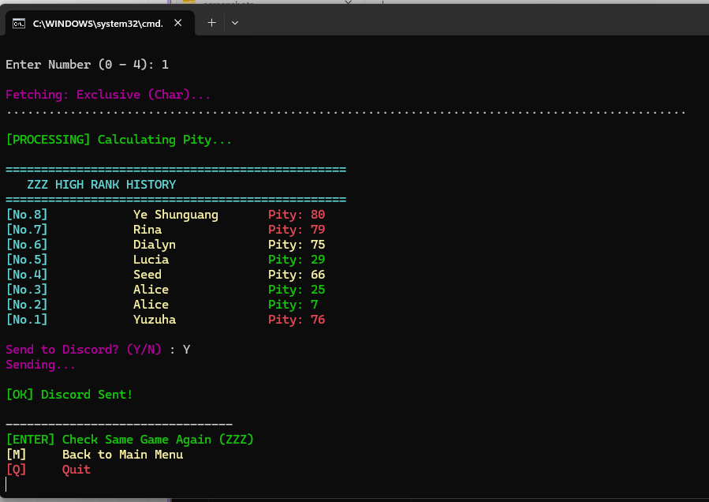

<div align="center">

# 🌠 Universal Hoyo Wish Counter

[](./README_TH.md)
[](./README.md)

**All-in-One Gacha Tracker for Genshin Impact, Honkai: Star Rail, and Zenless Zone Zero.**
Safe, Local, and Discord-Ready.


*(Example of the Discord Report output)*

</div>

---

## 📂 File List
| File Name | Description |
| :--- | :--- |
| **Run_Genshin.bat** | 🌑 Launcher for **Genshin Impact**. |
| **Run_HSR.bat** | 🚂 Launcher for **Honkai: Star Rail**. |
| **Run_ZZZ.bat** | 📺 Launcher for **Zenless Zone Zero**. |
| **HoyoWish.ps1** | ⚙️ **Core Script:** Handles logic, API fetching, and Discord integration. |
| **config.json** | 📝 **Settings:** Stores your Discord Webhook URL (Optional). |

---

## 🚀 Usage Guide

Since this tool runs in **Safe Mode** (local file reading), you need to manually provide the cache file.

### 📌 PHASE 1: Prepare the File

#### 1️⃣ Refresh the Key 🔑
Open the game, go to the **History (Wish/Warp/Signal)** menu.
Wait for the list to load fully, then **close the menu**.
*(This action generates a fresh key in your storage).*

#### 2️⃣ Get the 'data_2' File 📂
Navigate to your game's cache folder and copy the file named **`data_2`**.

> **Where is it?** (Check your game installation folder):
> *   **Genshin:** `.../Genshin Impact Game/GenshinImpact_Data(or YuanShen_Data) /webCaches/.../Cache/Cache_Data/`
> *   **Star Rail:** `.../Star Rail Game/StarRail_Data/webCaches/.../Cache/Cache_Data/`
> *   **ZZZ:** `.../ZenlessZoneZero Game/ZenlessZoneZero_Data/webCaches/.../Cache/Cache_Data/`

#### 3️⃣ Place the File ⬇️
Paste the `data_2` file into this **Hoyo Gacha Counter** folder (where the `.bat` scripts are).
**Make sure your folder looks like this:**


---

### ⚡ PHASE 2: Run the Tool

#### Step 1: Launch & Main Menu 🎮
Double-click the **`.bat`** file or run the script via PowerShell. You will see the **Main Menu**:
*   **Select Game:** Type `1`, `2`, or `3`.
*   **Toggle Display (Optional):** Type **`T`** to switch between **Date** or **Sequence [No.]** mode.


#### Step 2: Drag & Drop 🖱️
The console will ask for the cache file. **Drag and drop the `data_2` file** into the window and press **Enter**.


#### Step 3: Select Banner 🔢
Choose which banner to fetch. Type **`0`** for **FETCH ALL** (Recommended).


#### Step 4: Results & Loop 🔄
After the report is sent, you don't need to close the app!
*   **[ENTER]**: Check the **same game again** (Instant refresh).
*   **[M]**: Go back to **Main Menu**.



---

## 💬 Discord Setup (Optional)
To enable Discord notifications:

1.  Create a file named `config.json` in the same folder.
2.  Paste your Webhook URL inside like this:

```
json
{
    "webhook_url": "https://discord.com/api/webhooks/YOUR_WEBHOOK_URL_HERE"
}
```

---
Note: The Discord report format syncs with your selected Display Mode. If you toggled "No." mode in the console, Discord will also show [No. XX] instead of the date.

## 🛠️ Troubleshooting
**Q: "No valid link found or AuthKey expired"**
A: The key in data_2 has expired. Open the **History menu in-game** again to refresh it, then run the script immediately.

**Q: "Visit too frequently" error.**
A: The script includes a built-in delay (600ms) to prevent this. If it still happens, wait 1-2 minutes and try again.

**Q: Script closes immediately or shows red errors.**
A: Make sure you run the **`.bat`** file, NOT the .ps1 file directly (unless you know how to execute PS scripts). Also, ensure you have dragged the correct data_2 file.

**Q: My Discord message shows "No history found".**
A: Ensure you selected the correct banner (or "FETCH ALL") and that your in-game history actually has records (records older than 6 months are deleted by the game server).

## 📜 Credits
**AuthKey Extraction:** The logic for parsing the local data_2 cache file is inspired by community methods used by paimon.moe.

**Script Development:** The Universal PowerShell scripts for calculation, API handling, and documentation were developed, refactored, and optimized with the assistance of AI.