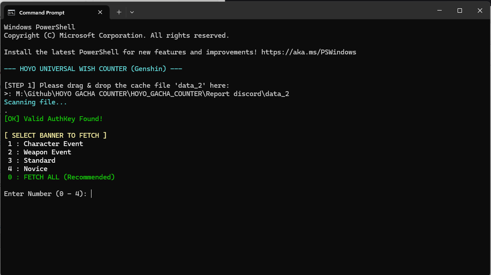

<div align="center">

# 🌠 Universal Hoyo Wish Counter

[](./README_TH.md)
[](./README.md)

**เครื่องมือนับประวัติกาชาแบบ All-in-One สำหรับ Genshin Impact, Honkai: Star Rail และ Zenless Zone Zero**
ปลอดภัย รันบนเครื่องตัวเอง (Local) และรองรับการแจ้งเตือนผ่าน Discord


*(ตัวอย่างผลลัพธ์ที่จะแสดงใน Discord)*

</div>

---

## 📂 รายชื่อไฟล์ (File List)
| ชื่อไฟล์ | คำอธิบาย |
| :--- | :--- |
| **Run_Genshin.bat** | 🌑 ตัวเปิดโปรแกรมสำหรับ **Genshin Impact** |
| **Run_HSR.bat** | 🚂 ตัวเปิดโปรแกรมสำหรับ **Honkai: Star Rail** |
| **Run_ZZZ.bat** | 📺 ตัวเปิดโปรแกรมสำหรับ **Zenless Zone Zero** |
| **HoyoWish.ps1** | ⚙️ **Core Script:** สคริปต์หลักสำหรับคำนวณและส่ง Discord (ห้ามลบ) |
| **config.json** | 📝 **Settings:** ไฟล์สำหรับใส่ Discord Webhook URL (ไม่บังคับ) |

---

## 🚀 คู่มือการใช้งาน (Usage Guide)

เครื่องมือนี้ทำงานใน **Safe Mode** (อ่านไฟล์ในเครื่องเท่านั้น) จึงไม่มีการขอรหัสผ่านใดๆ ปลอดภัย 100%

### 📌 PHASE 1: เตรียมไฟล์ Cache

#### 1️⃣ รีเฟรช Key ในเกม 🔑
เปิดเกมที่ต้องการเช็ค เข้าไปที่หน้า **ประวัติการอธิษฐาน (History/Warp/Signal)**
รอให้รายการโหลดจนครบ แล้ว **ปิดหน้าเมนูนั้น**
*(ขั้นตอนนี้จะทำให้เกมสร้างไฟล์ Key ล่าสุดขึ้นมาในเครื่อง)*

#### 2️⃣ หาไฟล์ 'data_2' 📂
เข้าไปที่โฟลเดอร์ติดตั้งเกมของคุณ เพื่อก๊อปปี้ไฟล์ที่ชื่อ **`data_2`**

> **ไฟล์อยู่ที่ไหน?** (ลองเช็คตาม Path นี้):
> *   **Genshin:** `.../Genshin Impact Game/YuanShen_Data/webCaches/.../Cache/Cache_Data/`
> *   **Star Rail:** `.../Star Rail Game/StarRail_Data/webCaches/.../Cache/Cache_Data/`
> *   **ZZZ:** `.../ZenlessZoneZero Game/ZenlessZoneZero_Data/webCaches/.../Cache/Cache_Data/`

*(มองหาโฟลเดอร์ที่มีเลขเวอร์ชันล่าสุด)*

#### 3️⃣ วางไฟล์ ⬇️
ก๊อปปี้ไฟล์ `data_2` มาวางในโฟลเดอร์ **Hoyo Gacha Counter** นี้ (ที่เดียวกับพวกไฟล์ `.bat`)
**เช็คให้ชัวร์ว่าวางถูกที่ ตามภาพนี้:**


---

### ⚡ PHASE 2: เริ่มการนับเกลือ

#### Step 1: เปิดโปรแกรม & ลากไฟล์ 🖱️
ดับเบิลคลิกที่ไฟล์ **`.bat`** ของเกมที่จะเช็ค (เช่น `Run_ZZZ.bat`)
หน้าต่างสีดำจะเด้งขึ้นมา ให้ **ลากไฟล์ `data_2`** (ที่เราวางไว้เมื่อกี้) ใส่เข้าไปในหน้าต่างนั้น แล้วกด **Enter**


#### Step 2: เลือกตู้ที่จะเช็ค 🔢
โปรแกรมจะถามว่าจะให้เช็คตู้ไหนบ้าง:
*   พิมพ์ **`0`** เพื่อดึงข้อมูล **ทุกตู้ (แนะนำ)**
*   หรือพิมพ์ตัวเลข (เช่น `1`) เพื่อเลือกดูเฉพาะตู้นั้นๆ



#### Step 3: เรียบร้อย! 🎉
สคริปต์จะทำการดึงข้อมูล คำนวณ Pity โชว์ให้ดูบนหน้าจอ และส่งรายงานสวยๆ เข้า Discord ของคุณทันที (ถ้าตั้งค่าไว้)

---

## 💬 การตั้งค่า Discord (ไม่บังคับ)
หากต้องการให้ส่งผลลัพธ์เข้า Discord ให้ทำดังนี้:

1.  สร้างไฟล์ชื่อ `config.json` ในโฟลเดอร์เดียวกัน
2.  วาง Webhook URL ของคุณลงไปตามรูปแบบนี้:

```json
{
    "webhook_url": "https://discord.com/api/webhooks/YOUR_WEBHOOK_URL_HERE"
}
หมายเหตุ: ถ้าไม่ต้องการใช้ Discord สามารถข้ามขั้นตอนนี้ได้เลย

---
## 🛠️ ปัญหาที่พบบ่อย (Troubleshooting)

**Q: ขึ้นข้อความ "No valid link found or AuthKey expired"**
A: Key ในไฟล์ data_2 หมดอายุครับ ให้เปิดเกม เข้าหน้าประวัติใหม่อีกรอบเพื่อรีเฟรช Key แล้วลองรันสคริปต์ทันที

**Q: หน้าต่างโปรแกรมเด้งปิดทันที หรือขึ้นตัวหนังสือสีแดง**
A: ตรวจสอบว่าคุณรันไฟล์ .bat (ไม่ใช่ .ps1) และลากไฟล์ data_2 ใส่ถูกต้องตามขั้นตอน
**Q: ใน Discord ไม่ขึ้นวันที่แบบละเอียด**
A: หากประวัติการเปิดของคุณยาวมากๆ (เกิน 4000 ตัวอักษร) โปรแกรมจะปรับวันที่ให้สั้นลงอัตโนมัติ (Short Date) เพื่อให้สามารถส่งข้อความผ่าน Discord ได้โดยไม่ Error

**Q: Discord ขึ้นว่า "No history found"**
A: ตรวจสอบว่าเลือกตู้ถูกต้อง (หรือเลือก FETCH ALL) และในเกมมีประวัติอยู่จริงๆ (ประวัติที่เก่าเกิน 6 เดือนจะถูกลบโดยเซิร์ฟเวอร์เกม)

---

## 📜 เครดิต (Credits)
*   **AuthKey Extraction: ลอจิกการแกะไฟล์ data_2 ได้แรงบันดาลใจจากวิธีที่ใช้ใน [paimon.moe](https://paimon.moe).
*   **Script Development: สคริปต์ PowerShell สำหรับคำนวณและเชื่อมต่อ API พัฒนาและปรับปรุงโค้ดด้วยความช่วยเหลือจาก AI