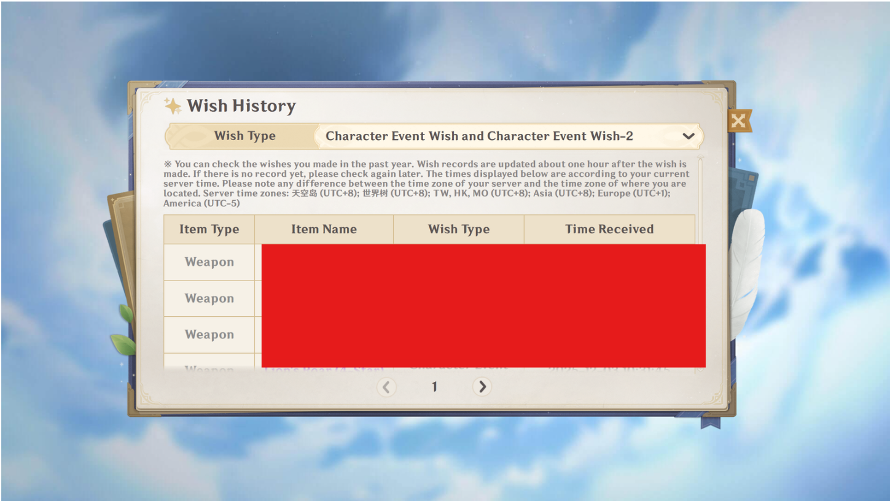
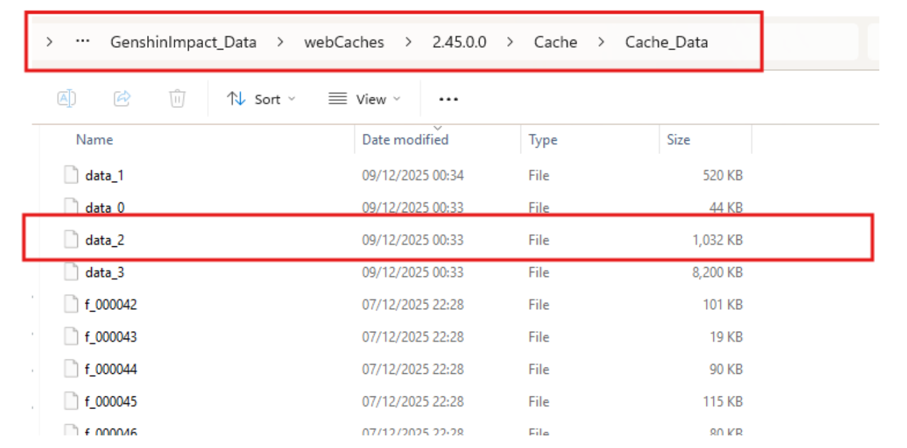
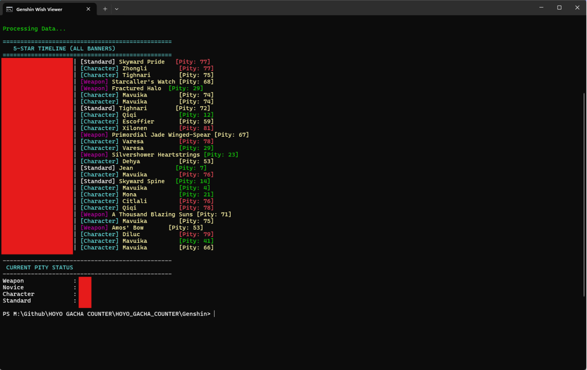

# 🌠 Genshin Impact Gacha Tool

โฟลเดอร์นี้ประกอบด้วยสคริปต์สำหรับดึงลิงก์ประวัติกาชา และคำนวณ Pity ของเกม Genshin Impact

## 📂 รายชื่อไฟล์
| ชื่อไฟล์ | คำอธิบาย |
| :--- | :--- |
| **1_GetLink.bat** | 🔑 **ขั้นที่ 1:** ค้นหาลิงก์ประวัติจากไฟล์ Cache และก๊อปปี้ลง Clipboard |
| **2_Calc_Character.bat** | 🧮 **ขั้นที่ 2 (ทางเลือก A):** คำนวณ Pity เฉพาะ **ตู้ตัวละคร** |
| **2_Calc_All.bat** | 📊 **ขั้นที่ 2 (ทางเลือก B):** คำนวณ Pity **ทุกตู้** (มาตรฐาน, อาวุธ, ตัวละคร) |

---

## 🚀 คู่มือการใช้งาน (ทีละขั้นตอน)

เนื่องจากเครื่องมือนี้ทำงานใน **Safe Mode** (อ่านไฟล์ในเครื่อง) คุณจำเป็นต้องหาไฟล์ Cache มาวางด้วยตัวเองตามขั้นตอนนี้:

### 📌 เฟส 1: หาไฟล์ `data_2`

#### 1️⃣ เปิดประวัติในเกม
เข้าไปที่หน้าอธิษฐาน (Gacha) กดปุ่ม **ประวัติ (History)** และรอให้รายการโหลดจนเสร็จ
*(ขั้นตอนนี้สำคัญมาก เพื่อให้เกมสร้าง Key ล่าสุดลงในเครื่อง)*

#### 2️⃣ หาโฟลเดอร์ Cache
เข้าไปที่โฟลเดอร์ที่ติดตั้งเกม Genshin Impact:
`Genshin Impact Game` ➔ `GenshinImpact_Data` ➔ `webCaches`

มองหาโฟลเดอร์ที่มี **เลขเวอร์ชั่นล่าสุด** (หรือดูวันที่ Date Modified ล่าสุด)

#### 3️⃣ หยิบไฟล์ 'data_2' และเช็คเวลา ⚠️
เข้าไปลึกอีกหน่อยที่: `.../Cache/Cache_Data/`
หาไฟล์ที่ชื่อว่า **`data_2`**

**🚨 ต้องเช็คตรงนี้ (สำคัญ):** ดูช่อง **"Date Modified" (วันที่แก้ไข)** ต้องเป็นเวลา **"เดี๋ยวนี้/ปัจจุบัน"** เท่านั้น
*(ถ้าเวลาเป็นของเมื่อวาน หรือเก่ากว่านั้น ให้กลับไปทำข้อ 1 ใหม่)*

#### 4️⃣ วางไฟล์
ก๊อปปี้ไฟล์ `data_2` มาวางไว้ในโฟลเดอร์ **Genshin** นี้ (ที่เดียวกับพวกไฟล์สคริปต์)
**จัดวางให้เหมือนในรูปนี้:**

---

### ⚡ เฟส 2: รันเครื่องมือ

#### ขั้นที่ 1: ดึงลิงก์ 🔑
รันไฟล์ **`1_GetLink.bat`** (มันจะถามหาไฟล์ ให้พิมพ์ชื่อไฟล์ หรือลากไฟล์ `data_2` ใส่หน้าต่างได้เลย)

*เมื่อเจอลิงก์ มันจะขึ้นว่า **"Link copied to clipboard"** แปลว่าพร้อมแล้ว*

#### ขั้นที่ 2: คำนวณ Pity 🧮
รันไฟล์ **`2_Calc_All.bat`** (แนะนำอันนี้) สคริปต์จะอ่านลิงก์จาก Clipboard และดึงข้อมูลให้อัตโนมัติ

**ทางเลือก A: ดูเฉพาะตู้ตัวละคร**

**ทางเลือก B: ดูTimeline รวมทุกตู้**

---

## 🛠️ การแก้ปัญหาเบื้องต้น (Troubleshooting)

**Q: มันฟ้องว่า "Clipboard is empty" หรือ "Invalid URL"**
A: คุณต้องรัน `1_GetLink.bat` ให้ผ่านก่อนครับ และต้องแน่ใจว่าเพิ่งเปิดหน้าประวัติในเกมมาสดๆ ร้อนๆ

**Q: ขึ้น Error ว่า "Too many retries"**
A: ทาง Hoyoverse เริ่มบล็อกการดึงข้อมูลชั่วคราวเพราะดึงถี่เกินไป ให้รอประมาณ 15-30 นาที แล้วค่อยลองใหม่

**Q: ทำไมเลข Pity ดูไม่ตรง?**
A: โปรแกรมจะนับต่อจาก "5 ดาวตัวล่าสุด" ที่มันเจอครับ ถ้าประวัติของคุณเก่าย้อนหลังไปนานมาก (เกิน 6 เดือน) จนหายไปจากเซิร์ฟเวอร์ การนับอาจจะคลาดเคลื่อนได้