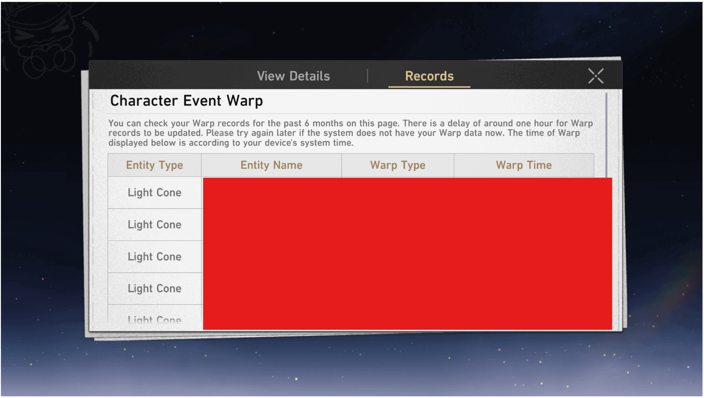
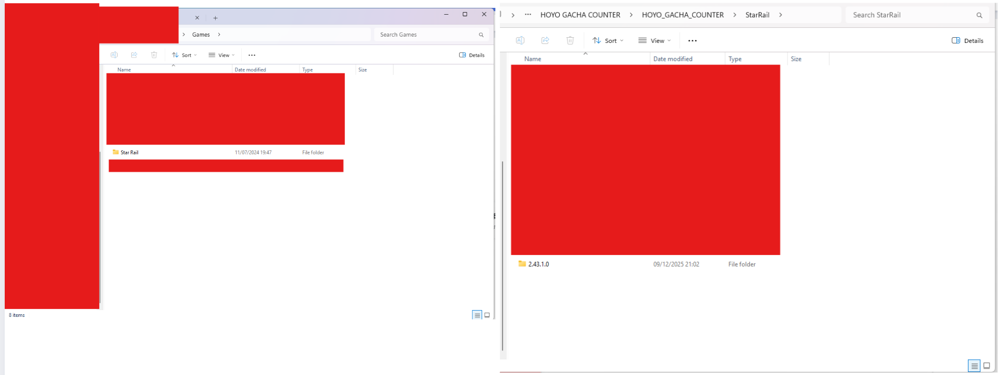
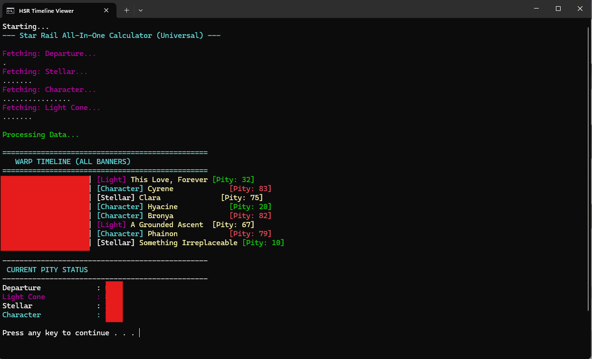

# 🌠 Honkai: Star Rail Warp Tool

This folder contains scripts to extract your Warp (Gacha) history URL and calculate your pity counter.

## 📂 File List
| File Name | Description |
| :--- | :--- |
| **1_GetLink.bat** | 🔑 **STEP 1:** Finds the Warp history link from the local file and copies it to Clipboard. |
| **2_Calc_HSR_Character.bat** | 🧮 **STEP 2 (Option A):** Calculates pity for **Character Event Warp** only. |
| **2_Calc_HSR_All.bat** | 📊 **STEP 2 (Option B):** Calculates pity for **ALL Warps** (Stellar, Light Cone, Character). |

---

## 🚀 Usage Guide

Since this tool runs in **Safe Mode** (local file reading), you need to manually provide the cache file.

### 📌 PHASE 1: Find the `data_2` file

#### 1️⃣ Open History in Game
Go to the **Warp** menu, click **"View Details"**, then select the **"History"** tab. Wait for it to load completely.
*(This action generates a fresh key in your storage).*

#### 2️⃣ Find the Cache Folder
Go to your Star Rail Installation folder:
`Star Rail Game` ➔ `StarRail_Data` ➔ `webCaches`

Look for the folder with the **Latest Version Number** (or latest Date Modified).

#### 3️⃣ Get 'data_2' & Check Date ⚠️
Go deeper into: `.../Cache/Cache_Data/`
Find the file named **`data_2`**.

**🚨 CRITICAL CHECK:** Look at the **"Date Modified"**. It must match **RIGHT NOW**.
*(If the time is old, go back to Step 1 and open History again).*

#### 4️⃣ Place the File
Copy the `data_2` file and paste it into this **StarRail** folder (where the scripts are).
**Make sure your folder looks like this:**

---

### ⚡ PHASE 2: Run the Tool

#### Step 1: Get the Link 🔑
Run **`1_GetLink.bat`**. It will ask for the path (or just drag `data_2` file onto the window).

*Once found, it will say **"Link copied to clipboard"**.*

#### Step 2: Calculate Pity 🧮
Run **`2_Calc_HSR_All.bat`** (Recommended). The script will automatically read the link from your clipboard and fetch data.

**Option A: Character Warp Only**

**Option B: All Warps (Timeline)**

---

## 🛠️ Troubleshooting

**Q: Script says "Clipboard is empty" or "Invalid URL"**
A: You must run `1_GetLink.bat` first. Make sure you opened the History page in the game recently.

**Q: "Too many retries" error**
A: The Hoyoverse API is temporary blocking requests because of speed. Wait 15-30 minutes and try again.

**Q: Pity count seems wrong?**
A: The tool counts from your *last* 5-star item. Ensure the history loaded completely (Game history only keeps data for 6 months).

---

## 📜 Credits
* **AuthKey Extraction:** The logic for parsing the local `data_2` cache file is inspired by [paimon.moe](https://paimon.moe).
* **Script Development:** The PowerShell scripts for calculation and documentation were developed, refactored, and reviewed with the assistance of AI.