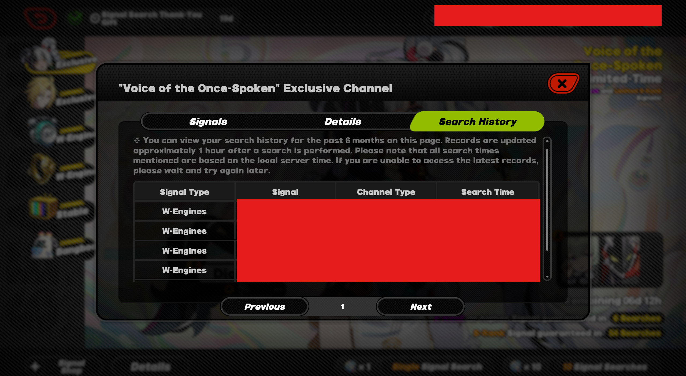
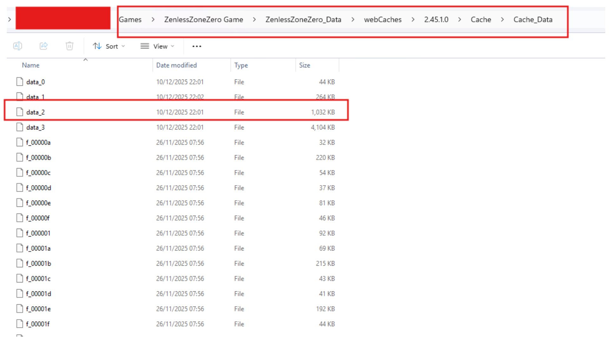
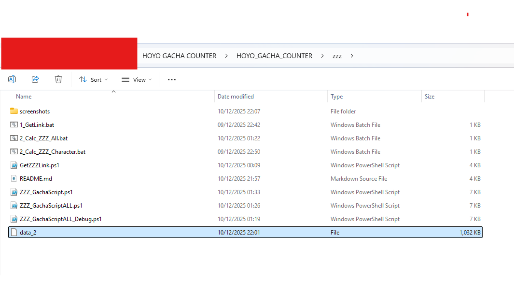
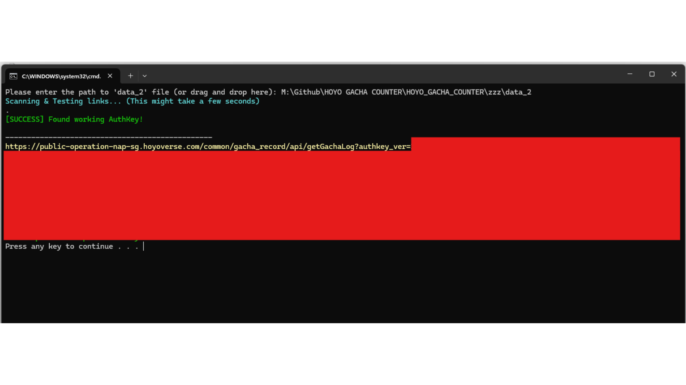
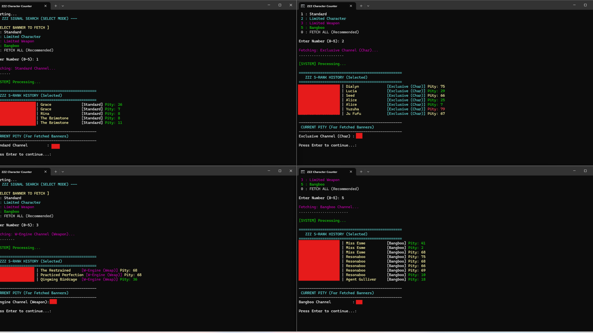
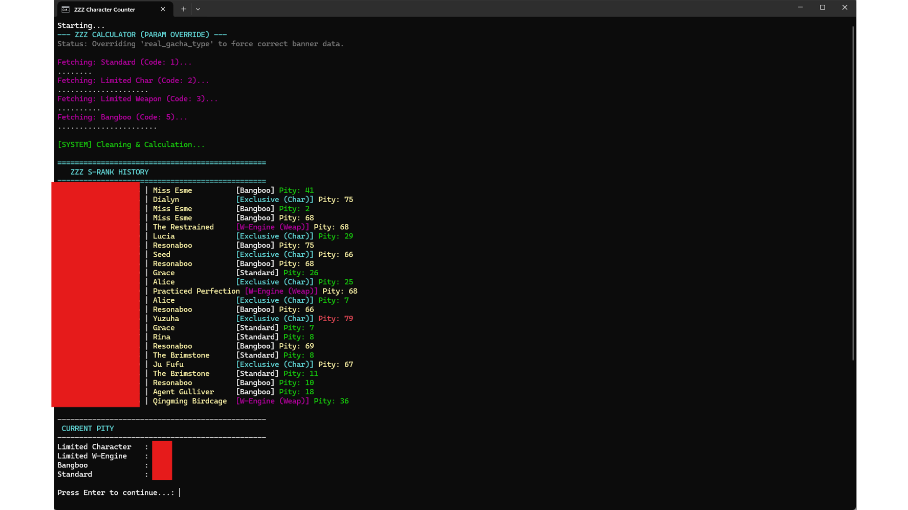

# 🌠 Zenless Zone Zero Signal Search Tool

โฟลเดอร์นี้ประกอบด้วยสคริปต์สำหรับดึงลิงก์ประวัติการค้นหาสัญญาณ (Signal Search) และคำนวณ Pity ของเกม Zenless Zone Zero

## 📂 รายชื่อไฟล์
| ชื่อไฟล์ | คำอธิบาย |
| :--- | :--- |
| **1_GetLink.bat** | 🔑 **ขั้นที่ 1:** ตัวดึงลิงก์แบบพิเศษ ใช้ระบบ **Brute Force** สแกนหา Key ที่ใช้งานได้จริงจากไฟล์ Cache ที่ซับซ้อนของ ZZZ |
| **2_Calc_ZZZ_Character.bat** | 🧮 **ขั้นที่ 2 (โหมดเลือกเอง):** มีเมนูให้เลือกได้ว่าจะดึงข้อมูลตู้ไหน (ตัวละคร, อาวุธ, Bangboo) หรือดึงทั้งหมด |
| **2_Calc_ZZZ_All.bat** | 📊 **ขั้นที่ 2 (อัตโนมัติ):** ดึงข้อมูลและคำนวณ Pity **ทุกตู้** (Standard, Bangboo, Character, Weapon) รวดเดียวจบ |

---

## ⚠️ ข้อจำกัดสำคัญ (ต้องอ่าน!)
**API ของ Zenless Zone Zero มีการดีเลย์ประมาณ 1 ชั่วโมง**
* หากคุณเพิ่งเปิดได้ตัวละครหรือ W-Engine ใหม่ ในเกมจะขึ้นโชว์ทันที
* แต่ **ในโปรแกรมนี้จะยังไม่ขึ้น**
* กรุณารออย่างน้อย **1 ชั่วโมง** เพื่อให้เซิร์ฟเวอร์อัปเดตข้อมูลมาที่ API

---

## 🚀 คู่มือการใช้งาน

เนื่องจากเครื่องมือนี้ทำงานใน **Safe Mode** (อ่านไฟล์ในเครื่อง) คุณจำเป็นต้องหาไฟล์ Cache มาวางด้วยตัวเองตามขั้นตอนนี้:

### 📌 เฟส 1: หาไฟล์ `data_2`

#### 1️⃣ เปิดประวัติในเกม
ไปที่เมนู **การค้นหาสัญญาณ (Signal Search)** กดปุ่ม **รายละเอียด (Details)** แล้วเลือกแท็บ **ประวัติ (History)** รอให้รายการโหลดจนเสร็จ
*(ขั้นตอนนี้สำคัญมาก เพื่อให้เกมสร้าง Key ล่าสุดลงในเครื่อง)*

#### 2️⃣ หาโฟลเดอร์ Cache
เข้าไปที่โฟลเดอร์ที่ติดตั้งเกม Zenless Zone Zero:
`ZenlessZoneZero Game` ➔ `ZenlessZoneZero_Data` ➔ `webCaches`

มองหาโฟลเดอร์ที่มี **เลขเวอร์ชั่นล่าสุด** (หรือดูวันที่ Date Modified ล่าสุด)

#### 3️⃣ หยิบไฟล์ 'data_2' และเช็คเวลา ⚠️
เข้าไปลึกอีกหน่อยที่: `.../Cache/Cache_Data/`
หาไฟล์ที่ชื่อว่า **`data_2`**

**🚨 ต้องเช็คตรงนี้ (สำคัญ):** ดูช่อง **"Date Modified" (วันที่แก้ไข)** ต้องเป็นเวลา **"เดี๋ยวนี้/ปัจจุบัน"** เท่านั้น
*(ถ้าเวลาเป็นของเมื่อวาน หรือเก่ากว่านั้น ให้ลบไฟล์ทิ้ง แล้วกลับไปทำข้อ 1 ใหม่)*

#### 4️⃣ วางไฟล์
ก๊อปปี้ไฟล์ `data_2` มาวางไว้ในโฟลเดอร์ **ZZZ** นี้ (ที่เดียวกับพวกไฟล์สคริปต์)
**จัดวางให้เหมือนในรูปนี้:**

---

### ⚡ เฟส 2: รันเครื่องมือ

#### ขั้นที่ 1: ดึงลิงก์ 🔑
รันไฟล์ **`1_GetLink.bat`** สคริปต์จะสแกนไฟล์เพื่อหา Key ที่ถูกต้องและก๊อปปี้ลง Clipboard ให้

#### ขั้นที่ 2: คำนวณ Pity 🧮
รันไฟล์ **`2_Calc_ZZZ_All.bat`** (แนะนำ) หรือ **`2_Calc_ZZZ_Character.bat`** (โหมดเลือกเอง)

**ทางเลือก A: โหมดเลือกเอง (เมนู)**

**ทางเลือก B: รวมทุกตู้ (Timeline)**

---

## 🛠️ การแก้ปัญหาเบื้องต้น (Troubleshooting)

**Q: มันฟ้องว่า "Clipboard is empty" หรือ "Invalid URL"**
A: รัน `1_GetLink.bat` ก่อนครับ ถ้ายังไม่ได้ ให้ลบไฟล์ `data_2` ทิ้ง แล้วเข้าเกมไปเปิดหน้าประวัติใหม่เพื่อให้ได้ไฟล์สดใหม่

**Q: รายการว่างเปล่า หรือของที่เพิ่งกดไม่ขึ้น?**
A: **รอ 1 ชั่วโมงครับ** API ของ ZZZ ช้ากว่าเกมอื่นของค่ายเดียวกัน

**Q: เลข Pity กระโดดไปมา หรือนับผิด?**
A: สคริปต์เวอร์ชั่นนี้ใช้ระบบการเรียงลำดับแบบพิเศษ (`Decimal Sort`) เพื่อแก้ปัญหา Timestamp ของ ZZZ แล้ว มั่นใจได้ว่าข้อมูลแม่นยำครับ

---

## 📜 เครดิต (Credits)
*   **AuthKey Extraction:** ปรับปรุง Logic เป็นแบบ Brute Force เพื่อรองรับไฟล์ Cache ของ ZZZ ที่มีความซับซ้อน
*   **Param Override:** เพิ่มระบบบังคับค่า Parameter เพื่อแก้ปัญหาที่ Server ล็อค Key ไว้กับตู้ใดตู้หนึ่ง
*   **การพัฒนา:** สคริปต์ PowerShell และคู่มือการใช้งาน พัฒนาและรีวิวโดยความช่วยเหลือจาก AI